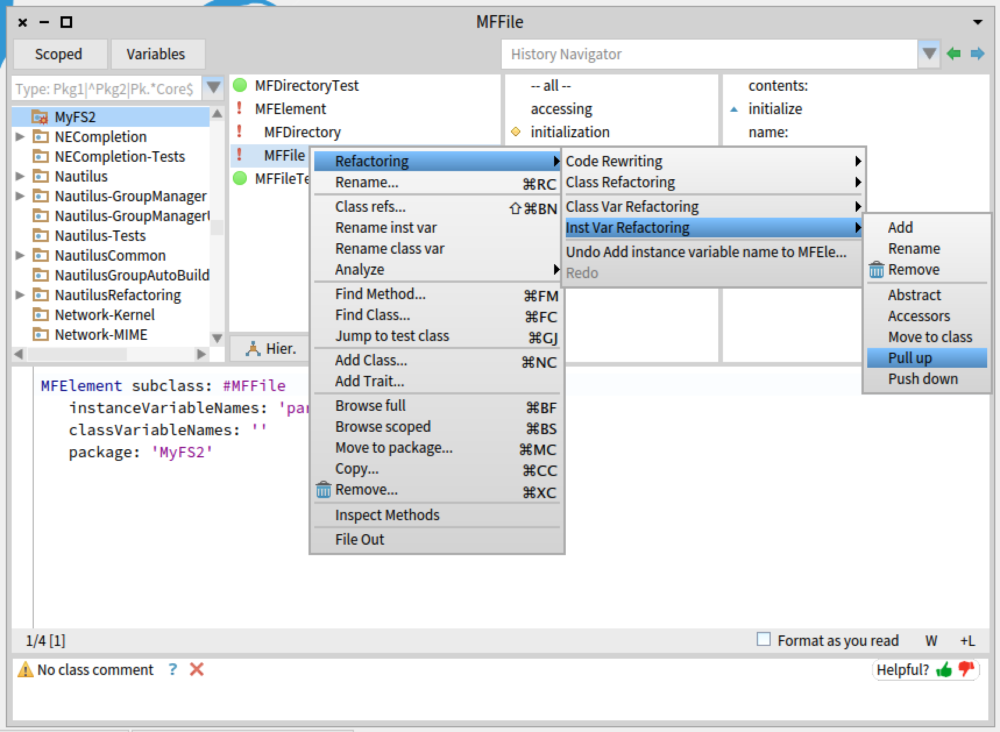
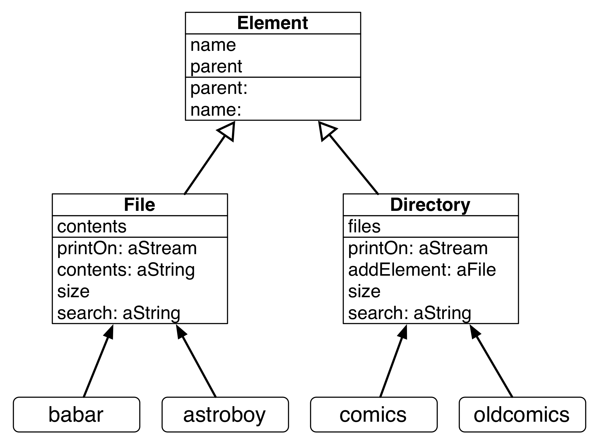

## Inheritance: Incremental definition and behavior reuse

@cha:inheritance

In Chapter *@cha:objectclass@*, we presented objects and classes. Objects are entities that communicate exclusively by sending and receiving messages. Objects are described by classes that are factories of objects. Classes define behavior and structure of all their instances: All the instances of a class share the same behavior but have their own private state. 

In this chapter, we present the fundamental concept of  _inheritance_ that allows a class to reuse and extend the behavior of another class. The idea is that as a programmer we do not want to rewrite from scratch a functionality if another class already offers it. A program specializes the implemented behavior into the new behavior he wants. Inheritance lets us express this concept specialization.  Using inheritance we create trees of concepts where more precise ones refine more abstract and generic ones. 

Inheritance is based on dynamic method lookup: a method is looked up dynamically within the inheritance tree starting from the class of the receiver. Once this explained we will show that it is possible to get code of a subclass invoked in place of the one of a superclass. 

To illustrate the important points of inheritance, we revisit the example of Chapter *@cha:objectclass@*. 


### Inheritance

Object-oriented programming is also based on the _incremental_ definition of abstractions. This _incremental_ definition mechanism is central to support reuse and extension of abstraction. It is called _inheritance_. The idea is that you can define a new abstraction \(a class\) by refining an existing one \(its superclass\). We said that a subclass inherits from a superclass. This way we reuse the code of the superclass instead of rewriting everything from scratch.

Class inheritance creates trees of classes. Such trees are based on _generalization_: a superclass is more generic than its subclasses. A class in such trees can have instances. All the instances share the behavior defined in their class and superclasses.
This is within such trees that the system looks up the method corresponding to a message sent to an instance of a class.

Inheritance supports code reuse because instance variable and methods defined in a root concept \(class\) are applicable to its refinements \(subclasses\).


We will use and extend the simple and naive example of files and directories (seen in Chapter *@cha:objectclass@*) to illustrate the key aspects of inheritance. While simple, it is enough to show the key properties of inheritance that we want to illustrate: 

- _incremental definition_: a subclass is defined by expressing the difference to its superclass. A subclass specializes its superclass behavior.
- _state reuse_: instances of a subclass have at least the state structure of the superclass.
- _behavior reuse_: upon message reception instances,  when the class of the receiver does not define a method, methods of the superclasses are executed instead.
- _behavior redefinition \(overriding\)_: a subclass may change locally a method definition inherited from its superclass.
- _behavior extension_: a subclass often extends the behavior of one of its superclasses by defining new methods and state.
- _subclass behavior can be invoked instead of superclass behavior_: behavior defined in a subclass may be executed in place of the one of a superclass. It means that with behavior overriding subclass behavior can be invoked in place of superclass behavior. This is a really important feature of inheritance.


### Improving files/directories example design


Let us go back to the example of files and directories introduced in previous chapter. 
When we look at the situation depicted by Figure *@FileDirectoryV1@* we see that a file is not the same as a directory, even though they share some common state: both have a name and a parent. In addition, they understand some common messages such as `size`, `search:`, `parent:` and `name:`. Remember that `size` and `search:` were not implemented the same way but the messages have indeed the same name. 


Load the code so that you can get the tests that we asked you to define at the end of chapter *@cha:objectclass@*.

```
To be updated
	Gofer new
	smalltalkhubUser: 'StephaneDucasse' project: 'Loop'; 
	version: 'MyFS2-StephaneDucasse.4';
	load
```


Verify that the tests are all passing \(green\).

#### Objectives


In the following sections we will take advantage of defining a common superclass and reuse its definition as shown in Figure *@FileDirectoryWithInheritanceObjective@*: It means sharing the maximum structure and behavior between the two classes. We will proceed step by step so that you can see all the steps and understand why this is working.


### Transformation strategies


Let us define a new class called `MFElement`. 

```
Object << #MFElement
	package: 'MyFS2'
```


As you may noticed it, this class is empty. Now we have two possible strategies: 
- either we make `MFFile` and `MFDirectory` inherit from `MFElement` and  step by step we migrate the common state and behavior to the superclass,
- or we define new state and behavior in `MFElement` and we remove it  from the two classes and when ready we make them inherit from `MFElement`. 


The second approach may work but it is too risky. Indeed with the first approach we can get a running system after any step we perform: why? Because we first inherit from the new class and move element from the subclasses to the classes and doing so we automatically reuse the superclass behavior and state so our program externally \(for example from the test perspective\) is not changed. With such an approach we can run our tests after any change and control our enhancements.

In addition, some of the operations such as moving an instance variable from a class to its superclass are tedious to perform. Here we will perform one operation manually but for the rest of the changes we will use _refactorings_ -- refactorings are program transformations that keep the behavior of the program the same.

Let us get started.

### Factoring out state


The first step is to make `MFFile` and `MFDirectory` subclasses of `MFElement` as follows:
```
MFElement subclass: #MFFile
	slots: { #parent . #name . #contents };
	package: 'MyFS2'
```


```
MFElement subclass: #MFDirectory
	slots: { #parent . #name . #files }; 
	package: 'MyFS2'
```


Now you can execute the tests and they will all pass. Now we get ready move some instance variables to the superclass.


#### Moving instance variable name to superclass


Since both `MFDirectory` and `MFFile` define that their instances should have a name, we can remove the instance variable `name` from them and uniquely define it in the superclass. We obtain the situation depicted in Figure *@FileDirectoryInhStateNameOnly@*.
Let us do that as follows: We remove it first from the `MFFile` and `MFDirectory` classes.
```
MFElement subclass: #MFFile
	slots: { #parent . #contents };
	package: 'MyFS2'
```


```
MFElement subclass: #MFDirectory
	slots: {#parent . #files };
	package: 'MyFS2'
```


And we add the instance variable `name` to the superclass `MFElement`.

```
Object subclass: #MFElement
	slots: { #name };
	package: 'MyFS2'
```


Pay attention that you should be careful and do it in this order else you may be in the situation where name will be defined in the superclass and in one of the subclasses and the system does not allow this and will forbid your action. 

Again run the tests they should pass again. 

What the tests execution proves is that we did not change the structure of the instances of `MFFile` and `MFDirectory`. Indeed the structure of an instance is computed from the instance variable lists defined in their class and all the superclasses of that class.

#### Moving parent to superclass


Since parent is defined in both subclasses, we can do the same for the instance variable parent to obtain the situation shown in Figure *@FileDirectoryInhFullStateOnly@*.
You can do it manually, as we did for the instance variable `name`, but you can also use a _refactoring_: Refactorings are powerful program transformations. Using the system browser, bring the menu on the class `MFFile`, select refactoring, then the instance variable category, and finally pull up, as shown in Figure *@Refactoring@*.




The system will ask you which variable you want to pull up, select `parent`. It will show you the changes that it is about to perform: removing the instance variable from both subclasses and adding one to the superclass. Proceed and the changes will be executed. Your
code should be now in the situation depicted in Figure *@FileDirectoryInhFullStateOnly@*.
Run the tests and they should again all pass!


What is important to see is that if we create a new subclass of `MFElement`, the instances of such class will automatically get `name` and `parent` as instance variables. This is one of the key property of inheritance: you can define a new abstraction structure by extending an existing one. 

Now we can do the same for the behavior: we will move similar methods in the superclass and remove them from their respective classes. 

### Factoring similar methods

The methods `parent:`, `parent` and `name:` are the same and defined in the two classes `MFFile` and `MFDirectory`. We will move them to the superclass `MFElement` following a similar process.

- First we will remove the method `name:` from the two classes `MFFile` and `MFDirectory` and add one version to the class `MFElement`. You can do this manually. 


- Second for the method `parent:`, use the method Refactoring _Push Up Method_ that is available from the method list.  You can repeat this for the method `parent` too. 


You should obtain the system described in Figure *@FileDirectoryInhAccessors@*.



Again run the tests and they should all pass. Why? Let us see what is happening when we send a message.


### Sending a message and method lookup 


Now it is time to explain what is happening when an object receives a message. In fact this is really simple but extremely powerful. When a message is sent to an object, first the corresponding method is looked up and once the method is found, it is executed on the object that initially received the message. 

- **Method Lookup**. When an object, the message receiver, receives a message, the method with the same selector than the message is looked up starting from the _class_ of receiver \(See step 1 in Figure *@BasicLookup@*\). When there is no method with the same selector, the look up continues in the superclass of the current class \(See step 2 in Figure *@BasicLookup@*\).
- **Method execution**. When a method with the same selector is found in a class, it is returned and executed on the receiver of the message \(See step 3 in Figure *@BasicLookup@*\). 


Let us look at our example. 
- When we send the message `astroboy parent: oldcomics`, the method named `parent:` is looked up in the class of the receiver i.e., `MFFile`. This class defines such a method, so it is returned and executed on the file `astroboy`.


- The tests pass because when we send the message `parent:` to an instance of the class `MFFile`, the corresponding method is looked up in the class `MFFile`. Since there is no method `parent:` in the class `MFFile`, the lookup continues in the superclass and find it in the class `MFElement` as shown in Figure *@BasicLookup@*.


#### Inheritance properties

While rather simple, the previous example shows some key properties of inheritance. 

Inheritance is a mechanism to define abstraction incrementally: a subclass is defined by expressing the difference to its superclass. A subclass refines a general concept into a more specific one. The classes `MFFile` and `MFDirectory` add extra behavior and state to the one defined in the superclass. As such they reuse the state and behavior of their superclass.

- _State reuse_: instances of a subclass have at least the structure of their superclasses \(`name` and `parent`\), local state can be added in addition \(`contents` and `files`\).


- _Behavior reuse_: when instances of a subclass receive a message, methods of the superclass may be executed. The method `parent:`, `parent`, and `name` are defined in `MFElement` but are executed on instances of the subclasses.


Inheritance creates trees of refined concepts. A superclass represents a more abstract concepts and its subclasses make it more and more specific by refining the superclass behavior or extending it by adding new behavior. 

### Basic method overrides


Since the method lookup starts from the class of the receiver, redefining a method in subclass takes precedence over the method defined in the superclasses.

If we define a method with the same name that one of its superclass, this new method will be executed instead of the one in the superclass. This is called a _method override_. This is useful to be able to redefine locally a behavior taking advantage of the specificities of the subclasses. In Figure *@BasicLookup@*, if we add a new method named `parent:` in the class `MFFile`, this method will be executed when the message `parent:` is sent to an instance of the class `File`. 

We will see later that we can also invoke the method of the superclass while doing a method overrides: it is useful when we want to _extend_ and not just fully change the superclass behavior. 

But before explaining this, method lookup and execution are systematically applied and we will see in the following sections that it is even more powerful than it may look at first sight.


### self-send messages and lookup create hooks


So far we explained how a message is resolved: first the corresponding method is looked up from the class of the receiver and goes up the inheritance tree. Second, the found method is executed on the message receiver. It means that in response to a message, a superclass method may be executed on its subclass instances. This is the same for message sent to `self` \(the receiver of the message\), we invoke the method lookup and `self` may be one subclass instances.

There is an important implication: when we have a message sent to `self` in a method, this message may lead to the execution of a method defined in subclasses: because a subclass may override such method. This is why self-sends are also called _hooks_ methods. We will explain carefully this point. 


#### Example


To explain precisely this important point, let us define a new little behavior: to build a better user interface for end-users we add a new message called `describe` that presents in more human friendly way the receiver of the message.
Here is a small example: 

```
| p el1 el2 |
p := MFDirectory new name: 'comics'.
el1 := MFFile new name: 'babar'; contents: 'Babar et Celeste'.
p addElement: el1.
el2 := MFFile new name: 'astroboy'; contents: 'super cool robot'.
p addElement: el2.
p describe
>>> 'I m a directory named comics'
el1 describe
>>> 'I m a file named babar'
```


#### Describe implementation 


We implement now the situation described by Figure *@fig:SelfSendLateBinding@*.
To implement this behavior, we define the following method `describe` in the class `MFElement`.

```
MFElement >> describe
	^ 'I m a ', self kind, 'named ', name  
```


We define the method `kind` to return a default string, even though we do not expect 
to create instances of this class and subclasses should define their own definition.

```
MFElement >> kind
	^ 'element'
```


In each of the subclasses, we define a corresponding method `kind`, as follows: 
```
MFDirectory >> kind
	^ 'directory'
```


```
MFFile >> kind
	^ 'file'
```


### Hook/Template explanations

Now we are ready to explain what is happening. Let us illustrate the execution of the `(MFFile new name: 'astroboy') describe`.

```
| el1 |
el1 := (MFFile new name: 'astroboy').
el1 describe
>>> 'I m a file named astroboy'
```


The following steps are executed: 
- The message `describe` is sent to `el1` an instance of the class `MFFile`. 
- The method `describe` is looked up in the class `MFFile` \(step 1 in Figure *@fig:SelfSendLateBinding@*\). It is not found, therefore the lookup continues to the superclass. 
- The lookup looks for the method `describe` in the class `MFElement`  \(step 2 in Figure *@fig:SelfSendLateBinding@*\). It is found and executed on the receiver: `el1`. 
- During the execution of the method `describe`, a new message `kind` using the expression `self kind` is sent \(step 3 in Figure *@fig:SelfSendLateBinding@*\).
- The message `kind` is looked up starting from the class of the receiver, `MFFile` \(step 4 in Figure *@fig:SelfSendLateBinding@*\). The method `kind` is found in class `MFFIle` and executed. 
- The rest of the method `describe` is executed and the resulting string is returned.


A vocabulary point: the method `describe` is called a _template_ method because it creates a context in which the `kind` methods are executed. The message `kind` is called a hook since subclass implementation may be invoked in this place.


This example illustrates the following important points:

- Each time we send a message the system chooses the correct method to be executed.
- Each time we send a self-send message we create a place where subclass methods may be executed. We create customization points.
- Since `self` represents the receiver and that receiver may be an instance from a class that is not loaded at the time the method containing the self-send, we say that `self` is dynamic. It represents the receiver of the message and the lookup for the method to execute starts in the class of the receiver. 


!!important Messages sent to the receiver \(`self` sends\) define customization points that subclasses can take advantage of to potentially see their code being executed in place of the superclass' one.

### Essence of self and dispatch


Now we take some time to look abstractly at what we presented so far. 
Imagine a situation as illustrated by Figure *@fig:LookupWithSelfInSuperclassMethod@*.

The first questions are simple and should be not a problem for you. Without looking at the solutions guess what are the results of the following messages.

```
A new foo
>>> ... 
B new foo
>>> ...
```


What is more interesting is the process to get the result of `B new bar`.

```
A new bar
>>> ...
B new bar
>>> ...
```


#### Solutions

The solutions are the following ones.
```
A new foo
>>> 10

B new foo
>>> 50

A new bar
>>> 10

B new bar
>>> 50
```


The most interesting one is `B new bar`.  Let us look at the execution of `aB bar`
1. `aB`'s class is `B`.
1. The method look up starts in the class `B`.
1. There is no method `bar` in `B`.
1. The look up continues in `A` and method `bar` is found.
1. The method `bar` is executed on the receiver  `aB`.
1. `self` refers to the receiver `aB`.
1. The message `foo` is sent to `self`.
1. The look up of `foo` starts in the `aB`'s class: `B`.
1. The method `foo` is found in class `B` and executed on the receiver `aB`.


!!important `self` represents the receiver. Messages sent to it are looked up from the class of the receiver. 

### Instance variables vs. messages


Reading the previous section you should now understand that there is in fact a difference between accessing directly an instance variable such as `name` in the method below and using an accessor as illustrated in the next redefinition. 

The two following method definitions are doing the same but have different extensibility potential.

```
MFElement >> describe
	^ 'I m a ', self kind, 'named ', name  
```


```
MFElement >> describe
	^ 'I m a ', self kind, 'named ', self name  
```


When you use an accessor, subclasses may redefine the behavior of the accessors.

```
MFElement >> name
	^ name
```


There is no systematic rule that states that we should systematically use accessors instead of instance variable access. 

What is important when you decide to use an accessor is to use it consistently. Indeed 
if some parts use direct instance variable access and other parts use accessors, then a programmer extending your code may redefine the accessors in a subclass and his code may not be invoked \(for example if you left places where you directly access an instance variable\).

In addition when you decide to use in your class an accessor it is also better that you do so for all the instance variables of the class. Else we may wonder why and uniformity makes the code more understandable.


### Conclusion


We presented the concept of inheritance: a subclass is defined as a refinement of a superclass. It reuses the superclass behavior and may extend the structure its instances will have. We show that method lookup happens dynamically and walks the inheritance tree starting from the receiver class.
We show that self-sends are creating hooks in the sense that subclass methods may be executed in place of the superclass counterpart. 

In the following chapter we will see that we can reuse even more methods between all the superclass and its subclasses.


