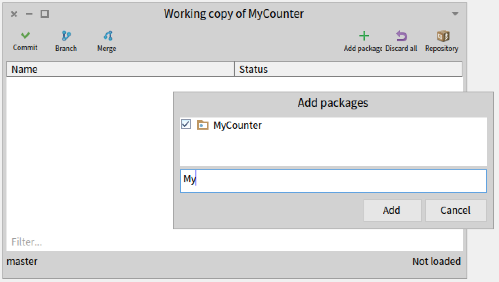
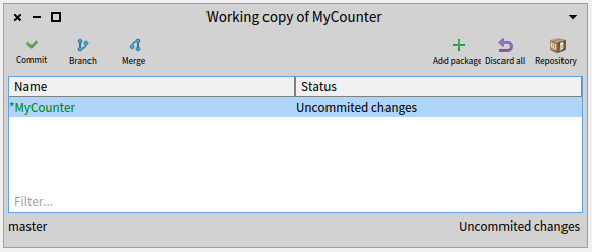
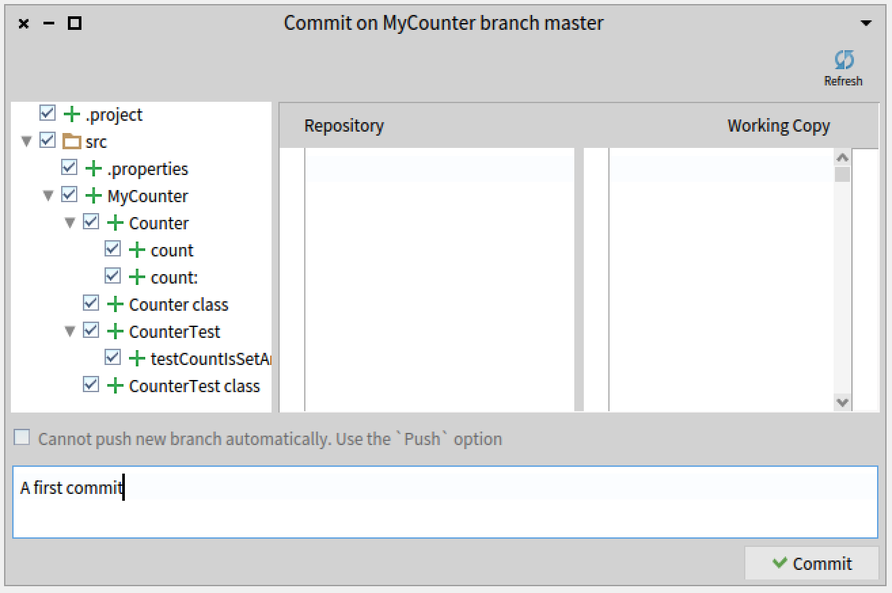
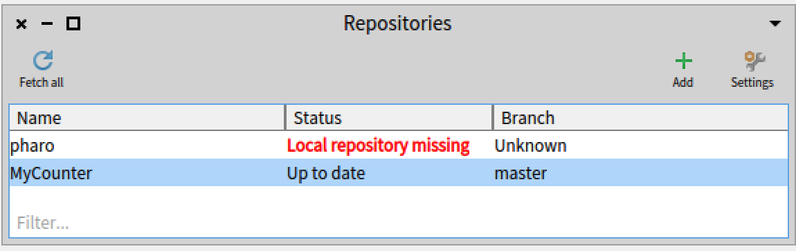
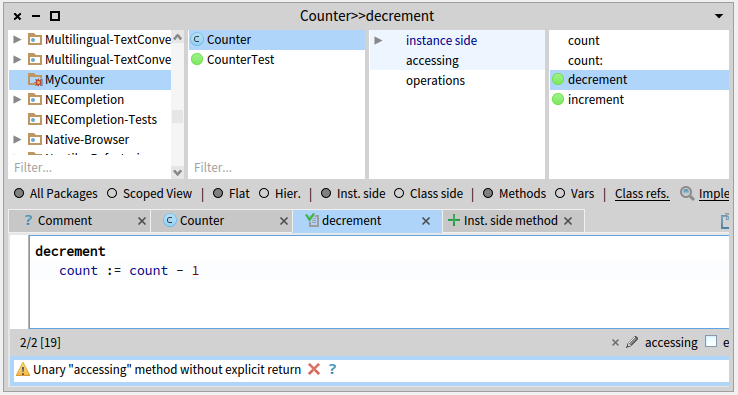
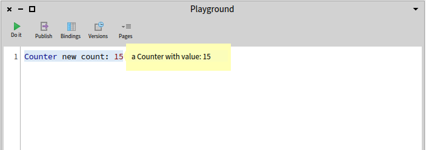
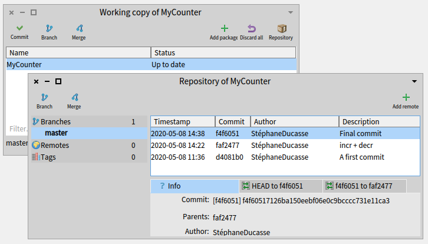
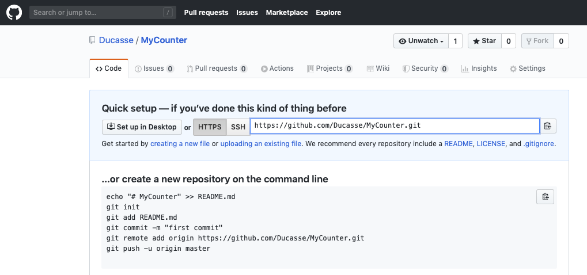
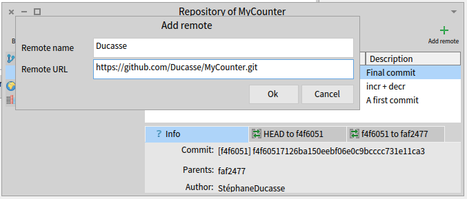
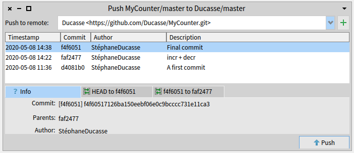

## A first tutorial: Developing a simple counter
@cha:counter

To start off in Pharo, let's write a simple counter by following the steps given below. In this exercise you will learn how to create packages, classes, methods, instances, unit tests and more. This tutorial covers most of the important actions you will perform when developing in Pharo. You can also watch the companion videos available in the Pharo MOOC at [http://mooc.pharo.org](http://mooc.pharo.org), which help illustrate this tutorial (they are called yy-Redo-xxx). We will also show you how to save your code with git hosting services such as GitHub using Iceberg.

Note that the development flow promoted by this little tutorial is _traditional_ in the sense that you will define a package, a class, _then_ define its instance variables, _then_ define its methods, and _then_ finally execute it. Now in Pharo, developers usually follow a different workflow called Extreme Test-Driven Development: they execute an expression that raises an error. These errors are caught by the Debugger and the developer codes directly in the debugger, allowing the system to define instance variables and methods on the fly for them.

Once you finish this tutorial, and you feel more confident in Pharo, we strongly suggest you do the exercise again using TDD: define and write a test, execute it, write the code to make the test pass and loop.
In Pharo you can also use Extreme TDD: define and write a test, execute it, write the code in the debugger to make the test pass. Extreme TDD is a super powerful approach. However, you cannot really get the real feeling of it without actually doing it yourself. There is another video in the Pharo mooc showing this powerful approach of coding. We really urge you to have a look at it and practice.

### Our use case

Here is our use case: We want to be able to create a counter, increment it twice, decrement it and check that its value is as expected. The following example shows this in action, and will make a perfect unit test - you will define one later. 

```language=smalltalk
| counter |
counter := Counter new.
counter increment; increment.
counter decrement.
counter count = 1
```

We will write all of the necessary classes and methods to support this example.
### Create a package and class

In this part, you will create your first class. In Pharo, a class is defined in a package, so we'll need to create a package first to put the class in. The steps are the same every time we create a class, so pay attention.
#### Create a package

Use the Browser to create a package (right-click in the package pane, select **New Package**). The system will ask you for a name, write `MyCounter`. This new package is then created, added to the package list, and selected by default. Figure *@figpackageCreated@* shows the expected result.

#### Create a class

The lower pane of the Browser should now be open with a tab showing the template for a class definition. To create a new class, you just need to edit this template and compile the class. There are **five** parts you might want to change:
- **Superclass**. This describes the superclass of the class you're creating. It defaults to `Object`, the least specialized of all classes in Pharo, which is what we want for our new Counter class. This won't always be the case: often you'll want to base a class on a more specific class.
- **Class Name**. Next, you should fill in the name of your class by replacing `#MyClass` with `#Counter`. Take care that the name of the class starts with a capital letter and that you do not remove the `#` sign in front of `#Counter`. This is because we name our classes using a **Symbol**, a unique string in Pharo which we write starting with a `#`. 
- **Instance Variables**. Then, you should fill in the names of the instance variables of this class next to `instanceVariableNames`. We need only one instance variable called `'count'`. Take care that you leave in the quotes!
- **Class Variables**. These are declared next to `classVariableNames:`; make sure it's an empty string as we will not need any class variables.
- **Package**. Here you specify the package name.

You should get the following class definition:

```
Object subclass: #Counter
      instanceVariableNames: 'count'
      classVariableNames: ''
      package: 'MyCounter'
```

We now have a class definition for the class `Counter`. To define it in our system we still have to _compile_ it - either through the context menu in the lower panel, or the shortcut `Cmd-S`. The class `Counter` is now compiled and immediately added to the system.
Figure *@figclassCreated@* illustrates the resulting situation that the browser should show.

The Pharo code critic tool will run automatically and shows some errors; don't worry about them for now, they're mainly about our class not being used yet.
As we are disciplined developers, we will add a comment to our `Counter` class by clicking the **Comment** pane and the **Toggle Edit / View comment** toggle. You can write the following comment:

```
`Counter` is a simple concrete class which supports incrementing and decrementing. 
Its API is 
- `decrement` and `increment`
- `count`
Its creation message is `startAt:`
```

Comments are written in Microdown, a dialect of Markdown that should be quite intuitive. They render nicely in the Browser. Again, accept these changes either through the menu or by hitting `Cmd-S`.
Figure *@CounterClassCommented@* shows the class with its comment.

### Defining protocols and methods

In this part you will use the Browser to learn how to add protocols and methods.
The class we have defined has one instance variable named `count`, and we're going to use that variable to keep count. We'll increment it, decrement it, and show its current value. But in Pharo we need to remember three things:
1. _Everything_ is an object
1. Instance variables are _completely private_ to the object
1. The _only_ way to interact with an object is by _sending messages_ to it

And so there is no other mechanism to access our instance variable from outside of our counter than by sending a message to the object. What must do is define a method that returns the value of the instance variable. Such methods are called _getter_ methods. So, let's define an accessor method for our instance variable `count`.
A method is usually placed into a _protocol_. These protocols are just a group of methods - they have no meaning in Pharo, but they do convey important information to the readers of your class. Although protocols can have any name, Pharo programmers follow certain conventions when naming protocols. If you define a method and are not sure what protocol it should be in, first take a look through existing code and see if you can find an appropriate protocol that already exists.
### Create a method

Now let us create the getter method for the instance variable `count`. Start by selecting the class `Counter` in a Browser, and make sure you are editing the instance side of the class (i.e., we define methods on _instances_ of our class) by selecting the instance side tab. Then define your method.
Figure *@MethodEditor@* shows the method editor ready to define a method.

As a general hint, double click at the end of or beginning of the text and start typing your method: this automatically replaces the template.
Write the following method definition:

```
count
   ^ count
```

This defines a method called `count`, which takes no arguments and returns the value of the instance variable `count`. Then choose _accept_ in the menu to compile the method. The method is automatically categorized in the protocol _accessing_.
Figure *@MethodDefined@* shows the state of the system once the method is defined.

You can now test your new method by typing and evaluating the next expression in a Playground:

```
Counter new count
>>> nil
```

This expression first creates a new instance of `Counter`, and then sends the message `count` to it. It retrieves the current value of the counter. This should return `nil` (the default value for non-initialized instance variables). Afterwards we will create instances with a reasonable default initialization value.
### Adding a setter method

Complementing the getter method we find the _setter_ method. These are used to change the value of an instance variable from outside the object. For example, the expression `Counter new count: 7` first creates a new `Counter` instance and then sets its value to `7` by sending it the message `count: 7`. Getters and setters are collectively referred to as _accessor_ methods.
This example shows a setter method in action:

```
| c |
c := Counter new count: 7.
c count
>>> 7
```

The setter method does not currently exist, so as an exercise create the method `count:` such that, when invoked on an instance of `Counter`, the instance variable is set to the argument of the message. Test your method by evaluating the example above in a Playground.
### Define a Test Class

Writing tests - whether you do it before or after you write your code - isn't really optional these days. A collection of well-written tests will support the evolution of your application, and give you confidence that your program does the things you expect it to do. Writing tests for your code is a good investment; test code is written once and executed a million times. For example, if we turned the example above into a test we could have checked automatically that our new setter method is working as expected. 
Our test cases, written as methods, need to live inside a test class that inherits from `TestCase`. So we define a class named `CounterTest` as follows:

```
TestCase subclass: #CounterTest
      instanceVariableNames: ''
      classVariableNames: ''
      package: 'MyCounter'
```

Now we can write our first test by defining a method. Test methods should start with _test_ to be automatically executed by the Test Runner or to get the little clickable circle next to the method name that lets you run the test.
Figure *@FirstGreenTest@* shows the definition of the method `testCountIsSetAndRead` in the class `CounterTest`.

Define the following method for our test case. It first creates an instance of a `Counter`, sets its value and then verifies that the value has been set. The message `assert:equals:` is a message implemented in our test class. It verifies a fact (in this case that two objects are equal), and will fail the test if the fact isn't true.

```
CounterTest >> testCountIsSetAndRead
   | c |
   c := Counter new.
   c count: 7.
   self assert: c count equals: 7
```

#### A typographic convention

Pharoers frequently use the notation `ClassName >> methodName` to identify the class to which a method belongs. For example, the `count` method we wrote above in our class `Counter` would be referred to as `Counter >> count`. Just keep in mind that this is not _exactly_ Pharo syntax, but more like a convenient notation we use to indicate "the instance method `count` which belongs to the class `Counter`".
From now on, when we show a method in this book, we will write the name of the method in this form. Of course, when you actually type the code into the browser, you don't have to type the class name or the `>>`; instead, you just make sure that the appropriate class is selected in the class pane.
Verify that the test passes by executing either pressing the circle icon in front of the method (as shown by Figure *@FirstGreenTest@*) or using the Test Runner.
As you now have your first green test, it's a good time to save your work.
### Saving your code as a git repository with Iceberg

Saving your work in the Pharo image is good, but it's not ideal for sharing your work or collaborating with others. Much of modern software development is mediated through git, an open-source version control system. Services such as GitHub are built on top of git, providing places where developers can work together building open source projects - like Pharo!
Pharo works with git through the tool **Iceberg**. This section will show you how to create a local git repository for your code, commit your changes to it, and also push those changes to a remote repository such as GitHub.
#### Open Iceberg

Open Iceberg through the **Sources** menu, or by hitting `Cmd-O,I`.

You should now see something similar to Figure *@EmptyIceberg@* which shows the top-level Iceberg pane. It shows the Pharo project, and a few other projects that also come with your image, and indicates that it could not find a local repository for them by showing 'Local repository missing'. You do not have to worry about the Pharo project or having a local repository if you do not want to contribute to Pharo.
We're going to create a new project of our own.
#### Add and configure a project

Press the button `Add` to create a new project. Select 'New Repository' from the left and you should see a configuration pane similar to the one in Figure *@CreateProject@*. Here we name our project, declare a directory on our local disk where the project's source should be saved, and also a subdirectory in the project itself which will be used to keep the Pharo code in -  conventionally this is the `src` directory.


#### Add your package to the project

Once added, the Iceberg _Working copy_ browser should show you an empty pane because we still haven't added any packages to our project. Click on the **Add package** button and select the package `MyCounter` as shown by Figure *@AddingPackage@*.



#### Commit your changes

Once your package is added, Iceberg shows you that there is uncommitted code in the packages managed by your project, as shown in Figure  *@SaveUncommited@*. Press the **Commit** button. Iceberg will show you all the changes that are about to be saved (Figure *@SaveUncommited2@*). Enter a commit message and commit your changes.





#### Code saved

Once you have committed, Iceberg indicates that your system and local repository are in sync.



Nicely done! We'll take a look at how to push these changes to a remote repository in a bit. But for now let's get back to our `Counter`.

### Adding more messages

We're going to test-drive the following messages for our `Counter` class. First, here's a test for the `increment` message:

```
CounterTest >> testIncrement
   | c |
   c := Counter new.
   c count: 0 ; increment; increment.
   self assert: c count equals: 2
```

Now you try it! Write a definition for the method `increment` that makes the test pass.
And when you've done that, try and write a test for the message `decrement`, then make _it_ pass by implementing the method on the `Counter` class.

#### Solution

```
Counter >> increment
   count := count + 1
```

```
Counter >> decrement
   count := count - 1
```



Your tests should all pass (as shown in Figure *@figclassTestCreated@*). Again, this is a good moment to save your work. Saving at point where tests are green is always good practice. To save your changes, you just have to commit them using Iceberg.

### Instance initialization method

Right now the initial value of our counter is not set as the following expression shows:

```
Counter new count
>>> nil
```

Let's write a test that asserts that a newly created `Counter` instance has 0 as the `count`:

```
CounterTest >> testInitialize
   self assert: Counter new count equals: 0
```

This time the test will turn _yellow_, indicating a test failure - the test ran fine, but the assertion did not pass. This is different to the _red_ tests we've seen so far, where the tests have failed because an error occurred (when a method has not been implemented, for instance).
### Define an initialize method

Now we have to write an initialization method that sets a default value of the `count` instance variable.
In Pharo, when creating a new object sending the message `new` to a class, the newly created instance is sent a message `initialize`. This gives the opportunity to the instance to initialize itself. 
Therefore we will define a `initialize` method that will correctly initialize the default value of a counter.

Since the `initialize` message is sent to a new instance, it means that the `initialize` method should be defined on the _instance side_, just like any method that is sent to an instance of `Counter` (`increment` and `decrement`). The `initialize` method is responsible for setting up the default values of instance variables.
And so, on the instance side of `Counter`, and in the `initialization` protocol, write the following method (the body of this method is left blank. Fill it in!).

```
Counter >> initialize
  "set the initial value of count to 0"

  "Your code here""
```

If you do this right, our `testInitialize` test will now pass.
As always, save your work before moving on to the next step.

### Define a new instance creation method

We just discussed how the `initialize` method is defined on the _instance side_ of our class, as it is responsible for altering an instance of `Counter`. Now let's take a look at defining a method on the _class side_ of a class. Class methods will be executed as a result of sending messages to the class itself, rather than to instances of the class. To define the method on the class, we need to toggle the Code Browser over to the class side by selecting **Class side**.
Define a new instance creation method called `startingAt:`. This method receives an integer as an argument and returns a new instance of `Counter` with the count set to the specified value.
What do we do first? Why, we define a test of course:

```
TestCounter >> testCounterStartingAt5
	self assert: (Counter startingAt: 5) count equals: 5
```

Here the message `startingAt:` is sent to the class `Counter` itself.
Your implementation should look something like:

```
Counter class >> startingAt: anInteger
	^ self new count: anInteger.  
```

Here we see the notation for identifying a _class side_ method in our text: `ClassName class >> methodName` just means "the class side method `startingAt:` on the class `Counter`".
What does `self` refer to here? As always, `self` refers to the object that the method is defined in, and so here it refers to the `Counter` class itself. 
Let's write another test just to make sure that everything is working:

```
CounterTest >> testAlternateCreationMethod
  self assert: ((Counter startingAt: 19) increment ; count) equals: 20
```

### Better object description

When you inspect a `Counter` instance, either through the Debugger or through opening an Inspector with `Cmd-I` on a `Counter new` expression, or even when you just run a **Print it** on a `Counter new`, you will see a very simplistic representation of your counter; it will just say `'a Counter'`:

```
Counter new
>>> a Counter
```

We would like a much richer representation, one that, for example, shows the counter's value. Implement the following method under the protocol `printing`:

```
Counter >> printOn: aStream
   super printOn: aStream.
   aStream nextPutAll: ' with value: ', count printString.
```

Note the message `printOn:` is sent to any object when it is printed using **Print it** (See Figure *@figBetterDescription@*) or inspected in an Inspector. By implementing the method `printOn:` on instances of `Counter` we can control how they are displayed, and we _override_ the default implementation defined in the `Object` class, which has been doing all the work up until now. We'll look at these ideas in more detail, as well as learn more about streams and `super`, later in the book.



In this case we'll let you define a test case for this method. A tip: send the message `printString` to `Counter new` to get its string representation, as generated by `printOn:`.

```
Counter new printString
>>> a Counter with value: 0
```

Now let's save our code again, but this time on a remote git server.
### Saving your code on a remote server

Up until now you saved your code on your local disc. We will now show how you can save your code on a remote git repository such as the one you can create on GitHub [http://github.com](http://github.com) or GitLab.

#### Create a project on the remote server

First you should create a project on your remote git server. Don't put anything in it! Things could get confusing. Name it something simple and obvious like "Counter" or "Pharo-Counter". This is the place we're going to send our Iceberg project to.

#### Add a remote repository in HTTPS access

In Iceberg, go to the Working Copy browser of your Counter repository by double-clicking on the repository. Then click on the icon that looks like a box, labeled **Repository**. This opens the Repository browser for the project, as shown in Figure *@Save7RepositoryBrowser@*.



Then you just have to add a remote repository for the project, which is as simple as clicking the big plus icon marked **Add remote**. You will be asked to give a name for the remote, which is just the label that git uses locally to identify it, and a URL for the remote. You can use HTTPS access (a URL that starts with `https://github.com` for GitHub), or SSH access (a URL that starts with `git@github.com`). SSH will require you to set up your SSH agent on your machine with the correct credentials (please consult your git remote provider for the details of how to achieve this). HTTPS will require you to use your git token. See in Figures *@Save8GitHubHTTPS@* and *@Save9AddRemote@* for using HTTPS.





#### Push
As soon as you add a valid server address, Iceberg will show a small red indicator on the **Push** button. This shows that you have changes in your local repository that have not yet been pushed to your remote repository. Al you have to do is press the **Push** button; Iceberg will show you the commits that will be pushed to the server as shown in Figure *@Save10CommitsSent@*.



Now you _really_ saved your code  will be able to reload from another machine or location. This skill will enable you to work remotely, and to share and collaborate with others. 

### Conclusion

In this tutorial, you learned how to define packages, classes, methods, and tests. The workflow of programming that we chose for this first tutorial is similar to most programming languages. However, in Pharo, smart and agile developers use a different workflow: Test-Driven Development (TDD). We suggest you redo this whole exercise by defining a test first, executing it, defining a method in the debugger, and then repeating. Watch the second "Counter" video of the Pharo MOOC available at [http://mooc.pharo.org](http://mooc.pharo.org) to get a better understanding of the workflow.
